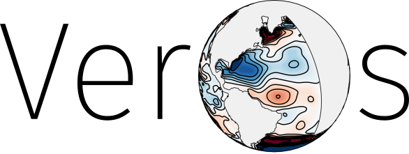

:tocdepth: 5

Ocean Simulation in pure Python
===============================

Veros, *the versatile ocean simulator*, aims to be the swiss army knife of ocean modeling.
It is a full-fledged GCM that supports anything between highly idealized configurations and realistic set-ups, targeting
students and seasoned researchers alike.

.. toctree::
   :maxdepth: 2
   :caption: Quick start

   quickstart/about
   quickstart/installation
   quickstart/usage
   quickstart/setup
   quickstart/development

.. toctree::
   :maxdepth: 1
   :caption: Tutorials

   tutorial/wave-propagation.ipynb
   tutorial/cluster

.. toctree::
   :maxdepth: 1
   :caption: More information

   faq

.. toctree::
   :maxdepth: 1
   :caption: Reference

   reference/api-setup
   reference/api-veros
   reference/settings
   reference/variables
   reference/diagnostics
   reference/cli
